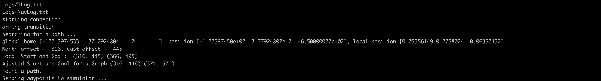

## Project: 3D Motion Planning

In this project we will implement methods of planning Quadrotor Flight Path.


---

# Required Steps for a Passing Submission:
1. Load the 2.5D map in the colliders.csv file describing the environment.
2. Discretize the environment into a grid or graph representation.
3. Define the start and goal locations.
4. Perform a search using A* or other search algorithm.
5. Use a collinearity test or ray tracing method (like Bresenham) to remove unnecessary waypoints.
6. Return waypoints in local ECEF coordinates (format for `self.all_waypoints` is [N, E, altitude, heading], where the drone’s start location corresponds to [0, 0, 0, 0].
7. Write it up.
8. Congratulations!  Your Done!


Flight Planner consists of 3 parts, hierarchial flight planner architecture consists of:

- Global Flight Planner: For planning  and plotting a path on scale of city map
- Local Flight Planner: For planning path on scale of city block
- Dynamic Flight Planner:

---
### Writeup / README

### Here I will consider the rubric points individually and describe how I addressed each point in my implementation.  

Changes made in planning_utils.py

#### Modified Action Class ####

Adding Diagonal action, which costs sqrt(2), valid_actions code will be changed aswell

```
    SOUTH_EAST = (1, 1, math.sqrt(2))
    NORTH_EAST = (-1, 1, math.sqrt(2))
    SOUTH_WEST = (1, -1, math.sqrt(2))
    NORTH_WEST = (-1, -1, math.sqrt(2))
```
#### Modified valid_actions Method ####

Since we added diagonal actions, we need to update the valid actions

```
    if x + 1 > n or y + 1 > m or grid[x + 1, y + 1] == 1:
        valid_actions.remove(Action.SOUTH_EAST)
    if x - 1 < 0 or y + 1 > m or grid[x - 1, y + 1] == 1:
        valid_actions.remove(Action.NORTH_EAST)
    if x + 1 > n or y - 1 < 0 or grid[x + 1, y - 1] == 1:
        valid_actions.remove(Action.SOUTH_WEST)
    if x - 1 < 0 or y - 1 < 0 or grid[x - 1, y - 1] == 1:
        valid_actions.remove(Action.NORTH_WEST)
```


#### Modified a_star function to calculate cost ####
The algorithm is used to find lowest cost path when paired with collinearity checks.
```
def a_star(grid, h, start, goal):
    path = []
    path_cost = 0
    queue = PriorityQueue()
    queue.put((0, start))
    visited = set(start)

    branch = {}
    found = False

    while not queue.empty():
        item = queue.get()
        # Line added
        current_cost = item[0]
        current_node = item[1]

        if current_node == goal:
            print('Found a path.')
            found = True
            break
        else:
            for a in valid_actions(grid, current_node):
                # get the tuple representation
                # da = action.delta
                next_node = (current_node[0] + a.delta[0], current_node[1] + a.delta[1])
                new_cost = current_cost + a.cost + h(next_node, goal)

                if next_node not in visited:
                    visited.add(next_node)
                    queue.put((new_cost, next_node))

                    branch[next_node] = (new_cost, current_node, a)

    if found:
        # retrace steps
        n = goal
        path_cost = branch[n][0]
        path.append(goal)
        while branch[n][1] != start:
            path.append(branch[n][1])
            n = branch[n][1]
        path.append(branch[n][1])
    else:
        print('**********************')
        print('Failed to find a path!')
        print('**********************')
    return path[::-1], path_cost
```

#### Added Collinearity method ####

Now we want to take the original plan of grid cells and extract waypoints for begining and end point.
Collinear: Any number of points that lie on the straight line. So if the lie on the same line remove middle points. Finding if the 3 points are lie in a straight line.

```
def collinearity_prune(path, epsilon=1e-5):
    """
    Prune path points from `path` using collinearity.
    """

    def point(p):
        return np.array([p[0], p[1], 1.]).reshape(1, -1)

    def collinearity_check(p1, p2, p3):
        m = np.concatenate((p1, p2, p3), 0)
        det = np.linalg.det(m)
        return abs(det) < epsilon

    pruned_path = [p for p in path]
    i = 0
    while i < len(pruned_path) - 2:
        p1 = point(pruned_path[i])
        p2 = point(pruned_path[i + 1])
        p3 = point(pruned_path[i + 2])

        # If the 3 points are in a line remove
        # the 2nd point.
        # The 3rd point now becomes and 2nd point
        # and the check is redone with a new third point
        # on the next iteration.
        if collinearity_check(p1, p2, p3):
            # Something subtle here but we can mutate
            # `pruned_path` freely because the length
            # of the list is check on every iteration.
            pruned_path.remove(pruned_path[i + 1])
        else:
            i += 1
    return pruned_path

```


#### 1. Provide a Writeup / README that includes all the rubric points and how you addressed each one.  You can submit your writeup as markdown or pdf.  

You're reading it! Below I describe how I addressed each rubric point and where in my code each point is handled.

### Explain the Starter Code

path_plan() method is responsible for:

1. Reading an area map into memory
2. Converting location position to city map
3. Calculating a flight path on city map
4. Successfully executing a flight path.


In this code, we are reading the first line from the csv file, extracting lat0 and lon0.

```
parts = open('colliders.csv').readlines()[0].split(',')
    lat0 = float(parts[0].strip().split(' ')[1])
    lon0 = float(parts[1].strip().split(' ')[1])
```
Now setting lon0, lat0 as home position with altitude as 0 and retieving the global position of the drone.
```
self.set_home_position(lon0, lat0, 0)

current_global_position = self.global_position
```

Here we are setting the local position using global position.

```
current_local_position = global_to_local(current_global_position, self.global_home)

```
Here we are reading the obstacle map and definining a grid, setting it altitude and safety margin around obstacles.
```
data = np.loadtxt('colliders.csv', delimiter=',', dtype='Float64', skiprows=2)

grid, edges, north_offset, east_offset = create_grid_and_edges(data, TARGET_ALTITUDE, SAFETY_DISTANCE)

print("North offset = {0}, east offset = {1}".format(north_offset, east_offset))

```  
In this code, we are stetting the starting point of the grid, and then converting the start position from start position to current position.

```
grid_start = (-north_offset, -east_offset)
grid_start = (int(current_local_position[1])-north_offset, int(current_local_position[0])-east_offset)
```
Here we are offsetting the grid goal by 10 in north and east direction. After that we are converting from local position of the grid to global  position

```
grid_goal = (-north_offset + 10, -east_offset + 10)

lat_lon_grid_goal = local_to_global(
    (grid_goal[0], grid_goal[1], -TARGET_ALTITUDE),
    self.global_home)
```      
This line is responsible for finding the path from start to goal position 
```
(graph_start, graph_end) = find_start_goal_2d(edges, grid_start, grid_goal)
print('Ajusted Start and Goal for a Graph', graph_start, graph_end)
```

Networkx package has been used to to plot and visualise the points. a_star algorithm is also being implemented  

```
        G = nx.Graph()

        for e in edges:
            p1 = e[0]
            p2 = e[1]
            dist = np.linalg.norm(np.array(p2) - np.array(p1))
            G.add_edge(p1, p2, weight=dist)

        path, _ = a_star(grid, heuristic, grid_start, grid_goal)

```
In this code, we are going to add waypoints which our drone can follow    
```
waypoints = [[p[0] + north_offset, p[1] + east_offset, TARGET_ALTITUDE, 0] for p in path]
self.waypoints = waypoints
self.send_waypoints()

``` 

### Execute the flight

Flight path is executed on the global points:

